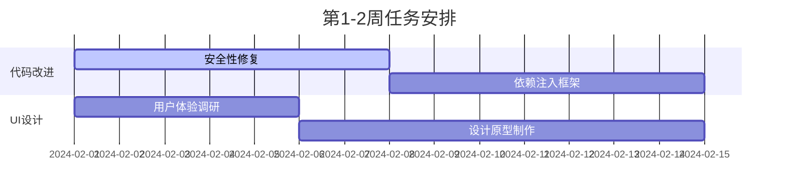
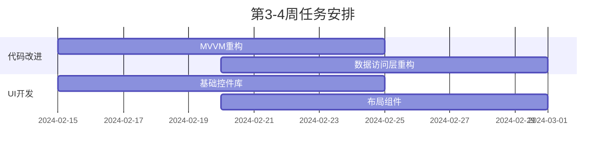
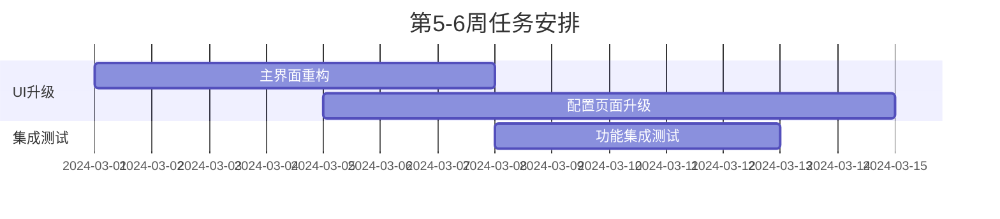

# DataView Config Tool V2 - 改进路线图

## 概述

本文档制定了同时进行代码质量改进和UI布局升级的详细计划，确保两个方向的改进能够协调推进，最大化开发效率并降低风险。

## 🎯 总体策略

### 核心原则
1. **分层推进**：基础设施 → 架构重构 → UI升级 → 功能增强
2. **并行开发**：代码改进与UI设计可以并行进行
3. **渐进式升级**：避免大爆炸式重构，确保系统稳定性
4. **向后兼容**：保证现有功能不受影响

### 团队分工建议
- **后端开发团队**：专注代码架构改进和基础设施建设
- **前端/UI团队**：专注界面设计和用户体验优化
- **测试团队**：建立测试框架，确保质量

## 📅 详细实施计划

### 第一阶段：基础设施建设（2-3周）

#### 🔧 代码改进任务
**优先级：🔴 高**

1. **安全性修复**（第1周）
   ```csharp
   // 任务清单
   - [ ] 实现密码哈希存储（BCrypt）
   - [ ] 修复登录验证逻辑
   - [ ] 添加基础权限验证
   - [ ] 配置文件加密敏感信息
   ```

2. **依赖注入框架**（第1-2周）
   ```csharp
   // 实施步骤
   - [ ] 引入 Microsoft.Extensions.DependencyInjection
   - [ ] 创建服务接口定义
   - [ ] 重构 DbHelper 为服务
   - [ ] 建立服务容器配置
   ```

3. **错误处理统一**（第2周）
   ```csharp
   // 核心组件
   - [ ] IErrorHandlingService 接口
   - [ ] 统一异常处理中间件
   - [ ] 用户友好的错误消息
   - [ ] 结构化日志记录
   ```

#### 🎨 UI准备任务
**优先级：🟡 中**

1. **UI设计规划**（第1-2周）
   - [ ] 用户体验调研和需求分析
   - [ ] 现代化设计语言选择（Material Design / Fluent Design）
   - [ ] 色彩方案和主题设计
   - [ ] 组件库选择和定制

2. **设计原型**（第2-3周）
   - [ ] 主界面布局设计
   - [ ] 配置页面重新设计
   - [ ] 交互流程优化
   - [ ] 响应式布局考虑

### 第二阶段：架构重构（3-4周）

#### 🔧 代码改进任务
**优先级：🔴 高**

1. **MVVM架构优化**（第3-4周）
   ```csharp
   // 重构目标
   - [ ] 拆分 MainViewModel 职责
   - [ ] 实现 ViewModelBase 基类
   - [ ] 引入 INavigationService
   - [ ] 实现 IMenuService
   - [ ] 创建 IPermissionService
   ```

2. **数据访问层重构**（第4-5周）
   ```csharp
   // 实施内容
   - [ ] 实现 Repository 模式
   - [ ] 建立 UnitOfWork 模式
   - [ ] 异步数据操作
   - [ ] 事务管理规范化
   ```

3. **命令系统改进**（第4周）
   ```csharp
   // 改进内容
   - [ ] RelayCommand 实现
   - [ ] AsyncRelayCommand 实现
   - [ ] 命令参数验证
   - [ ] 命令状态管理
   ```

#### 🎨 UI基础组件开发
**优先级：🟡 中**

1. **基础控件库**（第3-4周）
   - [ ] 现代化按钮组件
   - [ ] 输入框组件（带验证）
   - [ ] 下拉选择组件
   - [ ] 数据表格组件
   - [ ] 对话框组件

2. **布局组件**（第4-5周）
   - [ ] 响应式网格系统
   - [ ] 侧边栏导航组件
   - [ ] 标签页组件
   - [ ] 面包屑导航
   - [ ] 工具栏组件

### 第三阶段：UI升级实施（4-5周）

#### 🎨 UI升级任务
**优先级：🔴 高**

1. **主界面重构**（第6-7周）
   ```xml
   <!-- 新的主界面结构 -->
   <Grid>
       <Grid.RowDefinitions>
           <RowDefinition Height="Auto"/> <!-- 标题栏 -->
           <RowDefinition Height="*"/>    <!-- 主内容区 -->
           <RowDefinition Height="Auto"/> <!-- 状态栏 -->
       </Grid.RowDefinitions>
       
       <!-- 现代化的侧边栏 + 主内容区布局 -->
   </Grid>
   ```

2. **配置页面升级**（第7-8周）
   - [ ] 点名配置页面重设计
   - [ ] 画面配置页面优化
   - [ ] 系统配置页面改进
   - [ ] 用户管理界面升级

3. **交互体验优化**（第8周）
   - [ ] 加载状态指示器
   - [ ] 操作反馈动画
   - [ ] 快捷键支持
   - [ ] 拖拽操作支持

#### 🔧 代码配合任务
**优先级：🟡 中**

1. **ViewModel适配**（第6-8周）
   - [ ] 适配新的UI组件
   - [ ] 数据绑定优化
   - [ ] 命令绑定更新
   - [ ] 验证逻辑集成

### 第四阶段：功能增强（2-3周）

#### 🚀 新功能开发
**优先级：🟢 低**

1. **用户体验增强**（第9-10周）
   - [ ] 主题切换功能
   - [ ] 界面布局保存/恢复
   - [ ] 快速搜索功能
   - [ ] 批量操作支持

2. **高级功能**（第10-11周）
   - [ ] 配置导入/导出向导
   - [ ] 数据备份/恢复工具
   - [ ] 操作历史记录
   - [ ] 实时数据同步

## 🔄 并行开发策略

### 分支管理策略
```
main
├── feature/security-improvements     # 安全性改进
├── feature/dependency-injection      # 依赖注入
├── feature/error-handling           # 错误处理
├── feature/ui-redesign              # UI重设计
├── feature/mvvm-refactor            # MVVM重构
└── feature/data-access-layer        # 数据访问层
```

### 开发流程
1. **每个功能独立分支开发**
2. **定期合并到 develop 分支**
3. **UI和代码改进可以并行进行**
4. **关键节点进行集成测试**

## 📋 具体实施建议

### Week 1-2: 基础设施 + UI设计


### Week 3-4: 架构重构 + 组件开发


### Week 5-6: UI实施 + 集成


## 🎯 关键里程碑

### 里程碑1：基础设施完成（第2周末）
- ✅ 安全性问题修复
- ✅ 依赖注入框架就绪
- ✅ 错误处理统一
- ✅ UI设计原型完成

### 里程碑2：架构重构完成（第4周末）
- ✅ MVVM架构优化
- ✅ 数据访问层重构
- ✅ 基础UI组件库完成

### 里程碑3：UI升级完成（第6周末）
- ✅ 主界面现代化
- ✅ 主要配置页面升级
- ✅ 用户体验优化

### 里程碑4：功能增强完成（第8周末）
- ✅ 新功能开发完成
- ✅ 全面测试通过
- ✅ 文档更新完成

## ⚠️ 风险控制

### 技术风险
1. **架构重构风险**
   - 风险：可能影响现有功能
   - 缓解：分步骤重构，保持向后兼容

2. **UI升级风险**
   - 风险：用户适应性问题
   - 缓解：提供主题切换，渐进式升级

3. **并行开发风险**
   - 风险：代码冲突和集成问题
   - 缓解：严格的分支管理和定期集成

### 进度风险
1. **资源不足**
   - 缓解：优先级管理，关键功能优先
2. **技术难度超预期**
   - 缓解：技术预研，备选方案准备

## 📊 成功指标

### 代码质量指标
- 代码覆盖率 > 70%
- 代码复杂度降低 30%
- 安全漏洞 = 0
- 性能提升 > 25%

### UI体验指标
- 界面响应时间 < 200ms
- 用户操作步骤减少 20%
- 界面一致性评分 > 90%
- 用户满意度 > 85%

## 🎉 总结

这个改进路线图平衡了代码质量提升和UI升级的需求，通过分阶段、并行推进的方式，确保：

1. **风险可控**：每个阶段都有明确的目标和验收标准
2. **效率最大化**：代码和UI改进并行进行，缩短总体时间
3. **质量保证**：每个阶段都有相应的测试和验证
4. **用户体验**：渐进式升级，避免用户适应性问题

建议按照这个路线图执行，根据实际情况调整时间安排和优先级。
